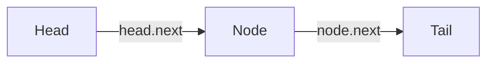
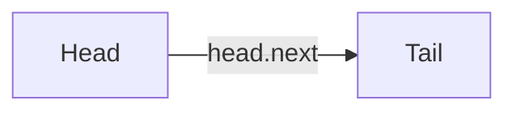
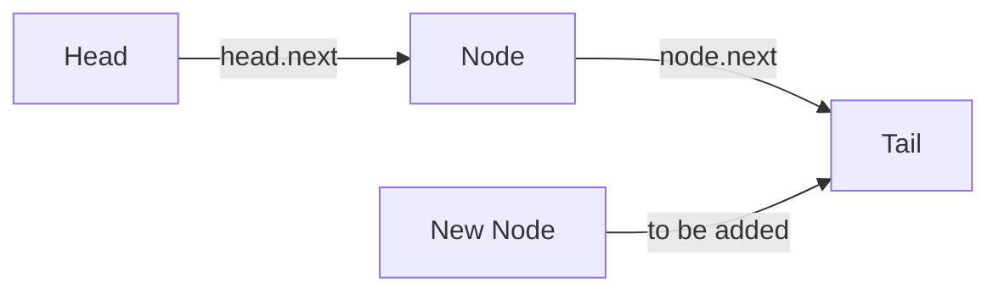
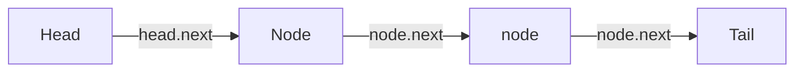

# Queues

Queues are a basic, singly-linked data structure with algorithms to complete the logic of a queues functionality.

Queues follow a FIFO (First In, First Out) principle - tiems added first are removed first.

When working with queues, we will typically have three core functions:

1. Enqueue - adding to the `tail` of the queue
2. Deque - removing from the `head` of the queue
3. Peek - checking the first item in the queue

## Removing items

Removing items will involve:

1. Checking the `head` exists. If not, return `undefined`.
2. Decrement the length by `1`. If the length is then `0`, set both `head` and `tail` to `undefined`.
3. The `head` of the queue must now be "removed". We do this by setting the head to the next value in the queue. In JS and other languages, garbage collection then handles this floating node.

`head` becomes `this.head.next`

## Adding items

Adding items will involve:

1. Incremementing the length by `1`.
2. Checking if `tail` exists. If not, set **both** `head` and `tail` to the newly added item. If only one item exists in the queue, it'll be both `head` and `tail`. Return after doing this to avoid further logic.
3. If `tail` already exists, `this.tail.next` becomes points to the new node, then `this.tail` becomes the new node to move it to the end of the queue.

`this.tail.next` becomes the new node, then `this.tail` becomes the new node

